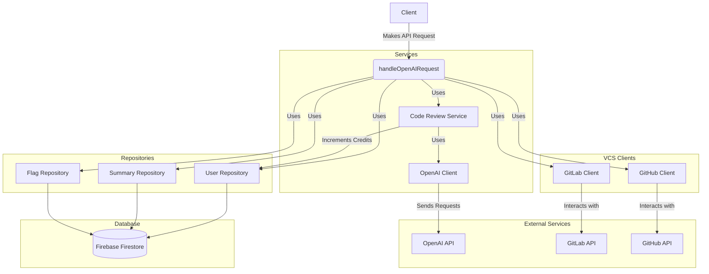
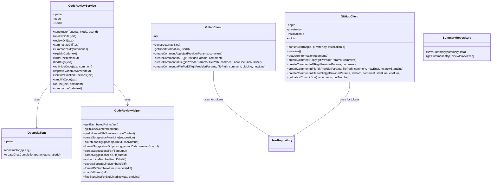
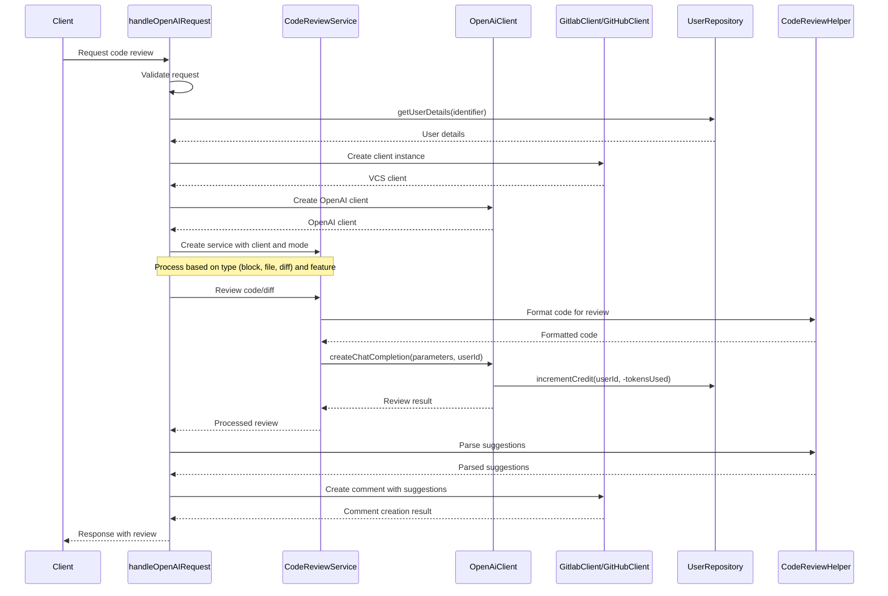
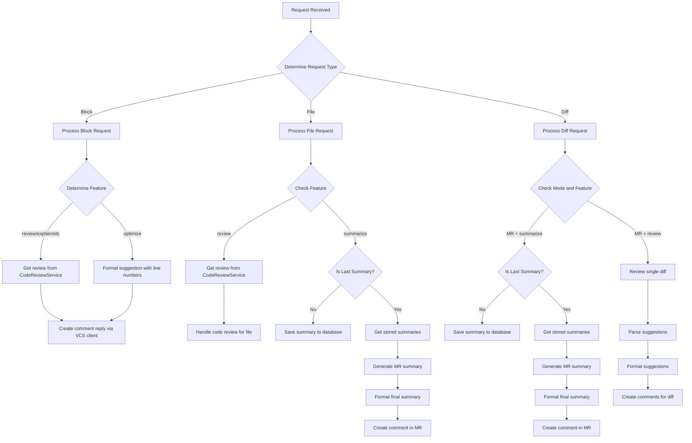
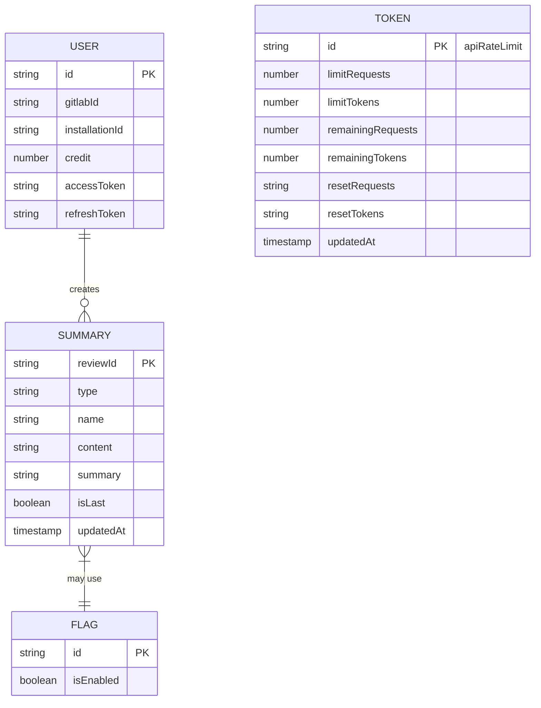

# Codemind Architecture Diagrams

I'll create multiple diagrams to visualize the architecture and flow of the Codemind system based on the provided code.

## 1. High-Level System Architecture

This diagram shows the main components of the system and how they interact.

## 2. Class Diagram - Main Components

This diagram shows the main classes and their relationships.

## 3. Sequence Diagram - Code Review Process

This diagram shows the sequence of actions when reviewing code.

## 4. Flowchart - Request Handler Decision Process

This flowchart shows the decision process in the request handler.

## 5. Entity Relationship Diagram

This diagram shows the data entities and their relationships.

## Summary of the Diagrams

1. **High-Level System Architecture**: Shows the main components of the system, including the handler, services, clients, repositories, and external services.

2. **Class Diagram**: Details the main classes in the system, their methods, and relationships.

3. **Sequence Diagram**: Illustrates the process flow for code review, from request to response.

4. **Flowchart**: Shows the decision-making process in the request handler.

5. **Entity Relationship Diagram**: Displays the data entities and their relationships in the Firebase Firestore database.

The system is a cloud-based service that processes code review requests, leveraging OpenAI's API to generate reviews and suggestions, and then sends those suggestions back through version control systems like GitLab and GitHub. The architecture follows a clean separation of concerns with dedicated components for each responsibility.
